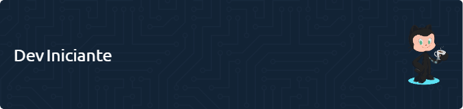

<!-- Profile Header Image -->

<h1 align="center">👋 Olá, Eu sou o Dev Iniciante 🚀</h1>

  <b>Apaixonado por Desenvolvimento Web | FullStack em formação</b>

---

## Sobre Mim

  
  🎓 <b>Aprendiz de FullStack</b>: Mergulhando de cabeça no mundo do desenvolvimento web, com foco em <b>Python</b>, <b>HTML</b>, <b>CSS</b> e <b>JavaScript</b>. 
  🌱 <b>Sempre Aprendendo</b>: Adoro aprender coisas novas e estou sempre em busca de novos desafios. 
  💡 <b>Curioso por Natureza</b>: Amo explorar novas tecnologias e ferramentas que facilitam a vida dos desenvolvedores. 
  🛠️ <b>Projetos Pequenos, Sonhos Grandes</b>: Comecei com pequenos projetos, mas tenho grandes sonhos!

---

## Linguagens e Ferramentas

  
  
  
  

---

## Meus Projetos 🛠️

<ul>
  <li>
    <b>Página Pessoal</b> 🌟 
    <i>Descrição:</i> Minha primeira página pessoal para me apresentar ao mundo. 
    <i>Tecnologias:</i> HTML, CSS, JavaScript 
    <i>Link:</i> <a href="https://github.com/dev-iniciante/pagina-pessoal">Página Pessoal</a>
  </li>
   
  <li>
    <b>ToDo List</b> ✔️ 
    <i>Descrição:</i> Um simples aplicativo de lista de tarefas para organizar o dia. 
    <i>Tecnologias:</i> HTML, CSS, JavaScript 
    <i>Link:</i> <a href="https://github.com/dev-iniciante/todo-list">ToDo List</a>
  </li>
   
  <li>
    <b>Jogo da Velha</b> 🎮 
    <i>Descrição:</i> Uma implementação divertida do clássico jogo da velha. 
    <i>Tecnologias:</i> HTML, CSS, JavaScript 
    <i>Link:</i> <a href="https://github.com/dev-iniciante/jogo-da-velha">Jogo da Velha</a>
  </li>
</ul>

---

## Conecte-se Comigo 🌐

  
  
  

---

  <b>"O único lugar onde o sucesso vem antes do trabalho é no dicionário." - Albert Einstein</b> 
  <b>Vamos codar e criar algo incrível hoje! ✨</b>

